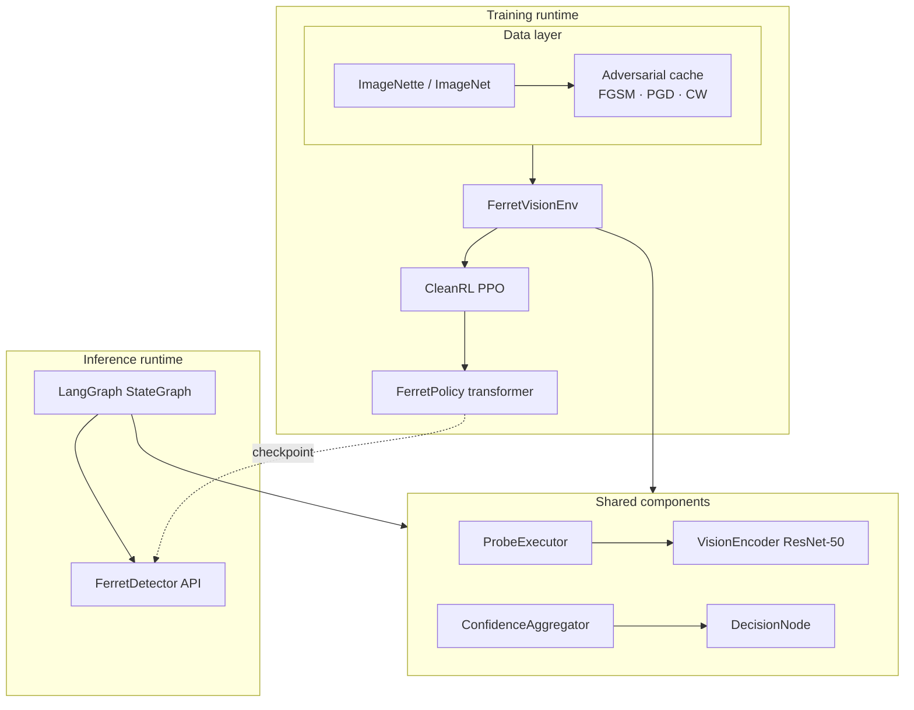
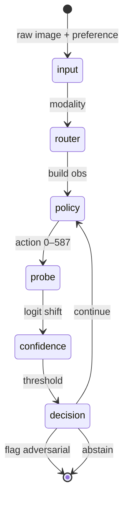
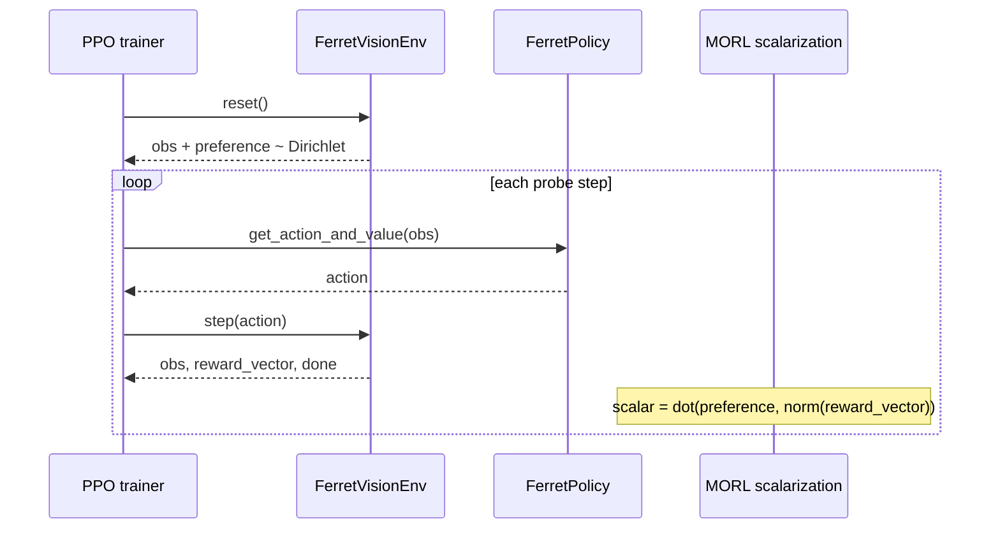
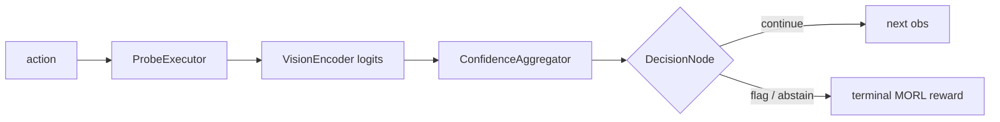
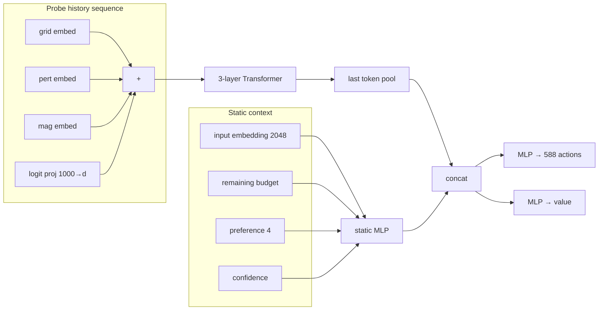
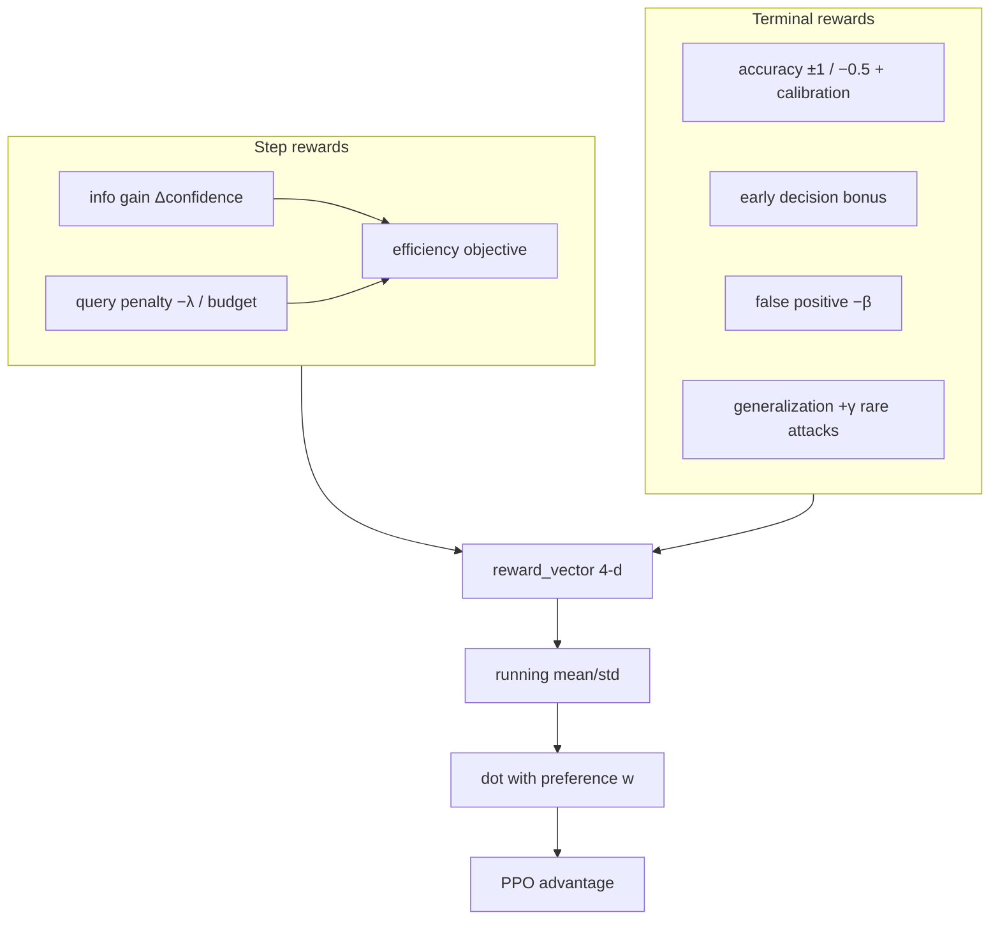
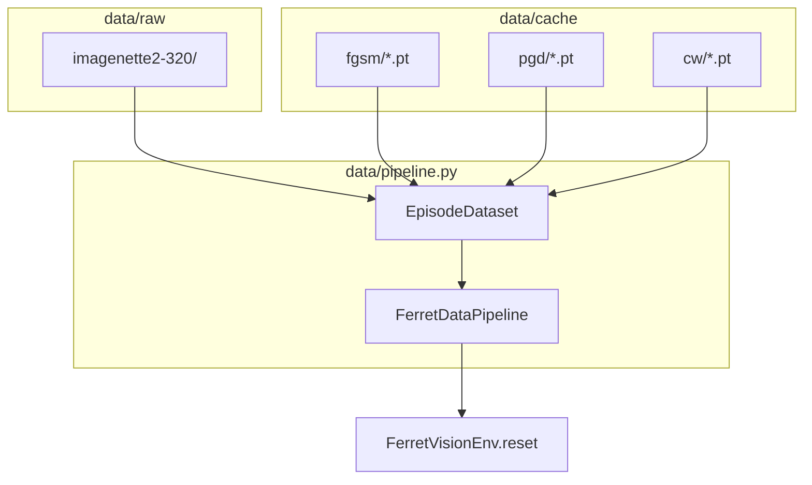

# Ferret System Architecture

Sequential adversarial probing agent: an RL-trained policy chooses where and how to perturb inputs under a fixed query budget, while a rule-based confidence aggregator makes detection decisions.

Technical spec: [`spec.md`](../spec.md)

---

## High-level overview

Ferret has two runtimes that share the same probe / confidence / decision logic:

| Runtime | Entry point | Purpose |
|---------|-------------|---------|
| **Training** | `train/ppo_train.py` + `env/vision_env.py` | Learn probing policy with CleanRL PPO + MORL scalarization |
| **Inference** | `graph/langgraph_agent.py` + `FerretDetector` | Deploy frozen policy as an explicit agent graph |



---

## LangGraph agent (inference)

Each graph lap is one probe macro-step: policy → probe → confidence → decision → loop or end.



### Node map

| Graph node | Module | Responsibility |
|------------|--------|----------------|
| `input` | `graph/nodes/input.py` | Init `EpisodeState`, baseline logits, preference vector |
| `router` | `graph/nodes/router.py` | Vision vs language (vision only today) |
| `policy` | `graph/nodes/policy.py` | Frozen `FerretAgent` → discrete probe action |
| `probe` | `graph/nodes/probe.py` | `ProbeExecutor` + target model logits |
| `confidence` | `graph/nodes/confidence.py` | Rule-based L2 logit-shift score |
| `decision` | `graph/nodes/decision.py` | Flag / continue / abstain |

### Inference usage

```python
from graph import FerretDetector

detector = FerretDetector.from_checkpoint("runs/<run>/policy.pt")
result = detector.detect(image_tensor, preference=np.array([0.4, 0.3, 0.2, 0.1]))
# result.flagged, result.confidence, result.probes_used
```

---

## RL training loop



### Environment step (inlined graph)

`FerretVisionEnv.step()` runs the same chain as the LangGraph loop in one call for vectorized PPO:



---

## Policy network



| Parameter | Value |
|-----------|-------|
| Action space | 49 grid × 4 perturbation × 3 magnitude = **588** |
| Max probes per episode | **10** |
| Input embedding | Frozen ResNet-50 pooled features (2048-d) |

---

## MORL reward (4 objectives)

Preference vector **w** is sampled per episode from Dirichlet(1,…,1) and concatenated to the policy input. Scalar PPO reward = **w · normalize(reward_vector)**.



| Index | Objective | Training weight in **w** |
|-------|-----------|---------------------------|
| 0 | Detection accuracy | w₁ |
| 1 | Query efficiency | w₂ |
| 2 | False positive rate | w₃ |
| 3 | Attack generalization | w₄ |

**λ annealing** (spec §4.4): `LambdaSchedule` ramps λ from `0.01` → `0.05` over training so early exploration uses the full budget.

Implementation note: we use **preference-conditioned linear scalarization** (`train/morl_scalarization.py`), which matches the MORL-Baselines pattern for conditioned policies without a second training stack.

---

## Data pipeline



- **Clean / adversarial mix** controlled by `adversarial_ratio`
- **Attack type** uniform over `{fgsm, pgd, cw}` when adversarial
- Precompute cache before training when `precompute_adversarial=True`

---

## Repository layout

```
ferret/
├── data/           # Download, datasets, adversarial cache, pipeline
├── env/            # FerretVisionEnv, unified factory
├── policy/         # VisionEncoder, FerretPolicy trunk
├── agents/         # Probe, confidence, decision
├── reward/         # MORL reward, λ schedule, normalizer
├── train/          # PPO, MORL scalarization, logging
├── graph/          # LangGraph nodes + FerretDetector
├── eval/           # POC probe, benchmark
├── ferret/         # Shared constants, EpisodeState
└── docs/           # This file
```

---

## Build phases (from spec)

| Phase | Status | Deliverable |
|-------|--------|-------------|
| 1 Vision POC | ✅ `eval/poc_probe.py` | Hardcoded probes, confidence separation |
| 2 RL policy | ✅ `train/ppo_train.py` | PPO + MORL on ImageNette |
| 3 Baselines | 🔲 | Feature Squeezing, Mahalanobis in `eval/benchmark.py` |
| 4 Unified / language | 🔲 | `language_env`, OLMo encoder |
| 5 Self-play | 🔲 | Attacker–detector co-training |

---

## How to run

### 1. Phase 1 POC (detection signal)

```bash
python -m eval.poc_probe --episodes 50 --attack-types fgsm --download
```

### 2. Training

```bash
# Fast dev run (FGSM cache only)
python -m train.ppo_train \
  --download-data \
  --attack-types fgsm \
  --total-timesteps 500000 \
  --num-envs 4 \
  --track  # optional wandb + TensorBoard
```

```bash
# Full attack mix (precompute PGD + CW first — slow)
python -m train.ppo_train \
  --attack-types fgsm pgd cw \
  --precompute-adversarial \
  --lambda-anneal
```

Logs: `runs/<exp_name>__<seed>__<ts>/` (TensorBoard + `policy.pt`)

### 3. Benchmark

```bash
python -m eval.benchmark --episodes 100 --checkpoint runs/<run>/policy.pt
```

### 4. Inference

```python
from graph import FerretDetector
detector = FerretDetector.from_checkpoint("runs/.../policy.pt")
result = detector.detect(image)
```

---

## Design constraints (spec-aligned)

| Constraint | Implementation |
|------------|----------------|
| Reward hacking via confidence | `ConfidenceAggregator` is rule-based, not learned |
| Budget collapse | Terminal efficiency bonus ∝ remaining budget |
| Action collapse | PPO entropy coefficient `ent_coef` |
| Attack overfitting | Mixed FGSM + PGD + CW from cache |
| Preference exploitation | Uniform Dirichlet sampling |
| λ too large early | λ annealing `0.01 → 0.05` |

---

## Future work

- Feature Squeezing + Mahalanobis baselines (Phase 3)
- Language modality + shared trunk transfer (Phase 4)
- Self-play attacker loop (Phase 5)
- Optional: native `morl-baselines` envelope training alongside current PPO
