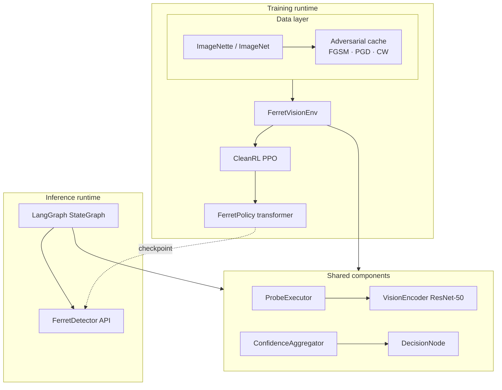
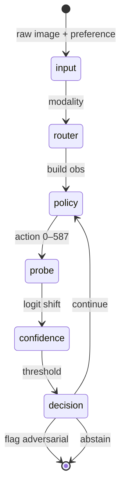
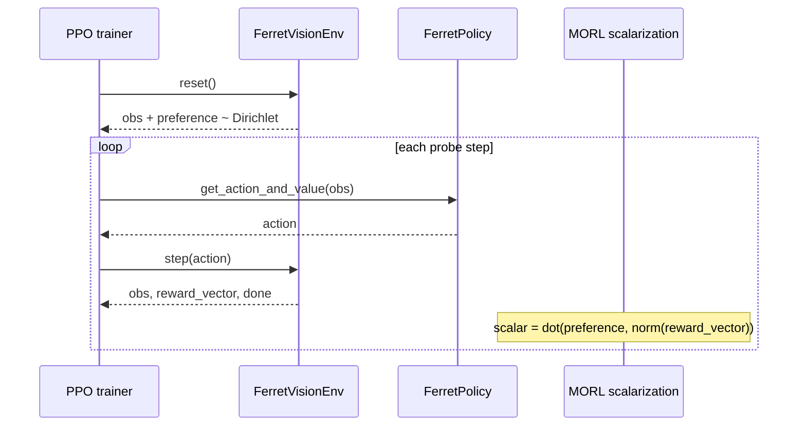
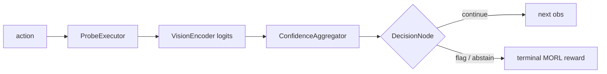
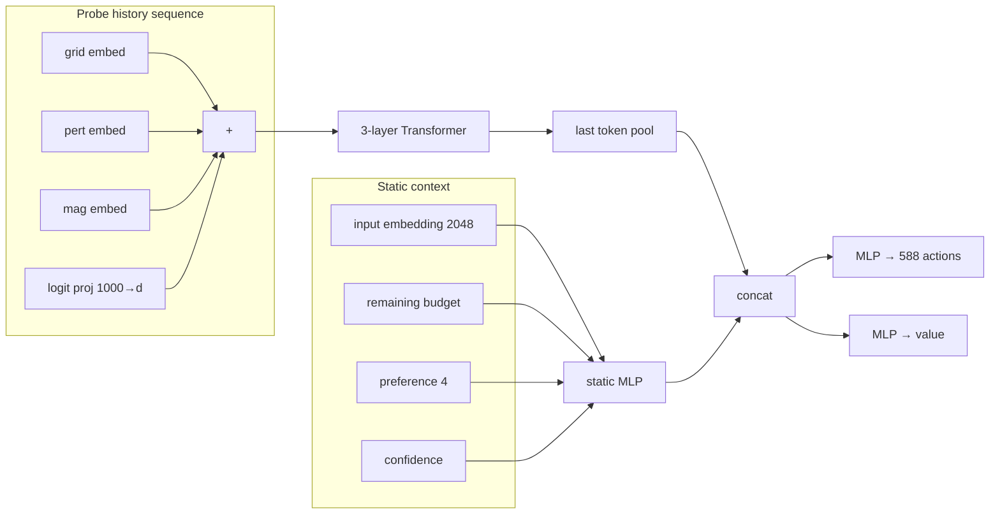
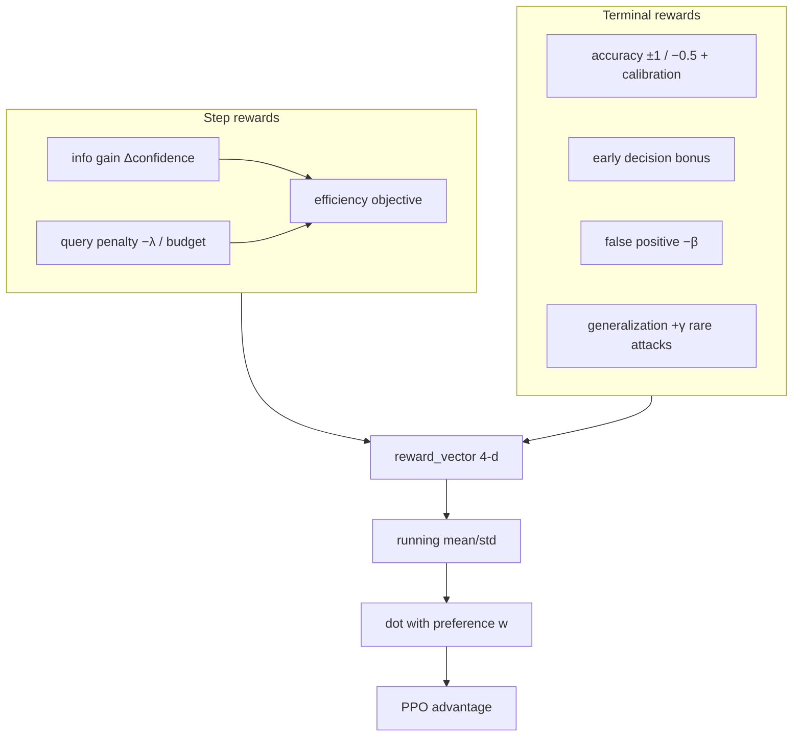
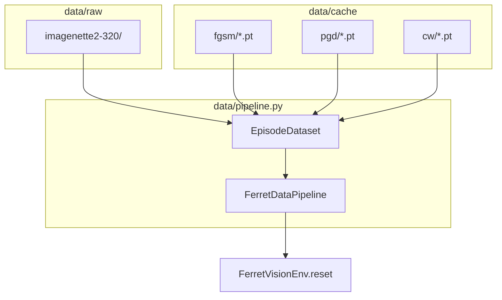

# Ferret System Architecture

Sequential adversarial probing agent: an RL-trained policy chooses where and how to perturb inputs under a fixed query budget, while a rule-based confidence aggregator makes detection decisions.

Technical spec: [`spec.md`](../spec.md)

---

## High-level overview

Ferret has two runtimes that share the same probe / confidence / decision logic:

| Runtime | Entry point | Purpose |
|---------|-------------|---------|
| **Training** | `train/ppo_train.py` + `env/vision_env.py` | Learn probing policy with CleanRL PPO + MORL scalarization |
| **Inference** | `graph/langgraph_agent.py` + `FerretDetector` | Deploy frozen policy as an explicit agent graph |



---

## LangGraph agent (inference)

Each graph lap is one probe macro-step: policy → probe → confidence → decision → loop or end.



### Node map

| Graph node | Module | Responsibility |
|------------|--------|----------------|
| `input` | `graph/nodes/input.py` | Init `EpisodeState`, baseline logits, preference vector |
| `router` | `graph/nodes/router.py` | Vision vs language (vision only today) |
| `policy` | `graph/nodes/policy.py` | Frozen `FerretAgent` → discrete probe action |
| `probe` | `graph/nodes/probe.py` | `ProbeExecutor` + target model logits |
| `confidence` | `graph/nodes/confidence.py` | Rule-based L2 logit-shift score |
| `decision` | `graph/nodes/decision.py` | Flag / continue / abstain |

### Inference usage

```python
from graph import FerretDetector

detector = FerretDetector.from_checkpoint("runs/<run>/policy.pt")
result = detector.detect(image_tensor, preference=np.array([0.4, 0.3, 0.2, 0.1]))
# result.flagged, result.confidence, result.probes_used
```

---

## RL training loop



### Environment step (inlined graph)

`FerretVisionEnv.step()` runs the same chain as the LangGraph loop in one call for vectorized PPO:



---

## Policy network



| Parameter | Value |
|-----------|-------|
| Action space | 49 grid × 4 perturbation × 3 magnitude = **588** |
| Max probes per episode | **10** |
| Input embedding | Frozen ResNet-50 pooled features (2048-d) |

---

## MORL reward (4 objectives)

Preference vector **w** is sampled per episode from Dirichlet(1,…,1) and concatenated to the policy input. Scalar PPO reward = **w · normalize(reward_vector)**.



| Index | Objective | Training weight in **w** |
|-------|-----------|---------------------------|
| 0 | Detection accuracy | w₁ |
| 1 | Query efficiency | w₂ |
| 2 | False positive rate | w₃ |
| 3 | Attack generalization | w₄ |

**λ annealing** (spec §4.4): `LambdaSchedule` ramps λ from `0.01` → `0.05` over training so early exploration uses the full budget.

Implementation note: we use **preference-conditioned linear scalarization** (`train/morl_scalarization.py`), which matches the MORL-Baselines pattern for conditioned policies without a second training stack.

---

## Data pipeline



- **Clean / adversarial mix** controlled by `adversarial_ratio`
- **Attack type** uniform over `{fgsm, pgd, cw}` when adversarial
- Precompute cache before training when `precompute_adversarial=True`

---

## Repository layout

```
ferret/
├── data/           # Download, datasets, adversarial cache, pipeline
├── env/            # FerretVisionEnv, unified factory
├── policy/         # VisionEncoder, FerretPolicy trunk
├── agents/         # Probe, confidence, decision
├── reward/         # MORL reward, λ schedule, normalizer
├── train/          # PPO, MORL scalarization, logging
├── graph/          # LangGraph nodes + FerretDetector
├── eval/           # POC probe, benchmark
├── ferret/         # Shared constants, EpisodeState
└── docs/           # This file
```

---

## Build phases (from spec)

| Phase | Status | Deliverable |
|-------|--------|-------------|
| 1 Vision POC | ✅ `eval/poc_probe.py` | Hardcoded probes, confidence separation |
| 2 RL policy | ✅ `train/ppo_train.py` | PPO + MORL on ImageNette |
| 3 Baselines | ✅ `eval/benchmark.py`, `eval/baselines.py` | Feature Squeezing, Mahalanobis, Pareto |
| 4 Unified / language | 🔲 | `language_env`, OLMo encoder |
| 5 Self-play | 🔲 | Attacker–detector co-training |

---

## Training plan

### Stage 0 — Environment verification (5 min, CPU)

Verify the full training loop runs without crashing before committing to cache precompute.

```bash
source .venv/bin/activate
python -m train.ppo_train \
  --adversarial-ratio 0 \
  --total-timesteps 5000 \
  --num-envs 2 \
  --num-steps 32 \
  --download-data
```

**Pass criteria:** no exception, TensorBoard SPS > 0, `runs/` directory created.

---

### Stage 1 — POC signal check (10 min, CPU)

Confirm the detection signal exists before training the policy.

```bash
make poc
# or: python -m eval.poc_probe --episodes 100 --attack-types fgsm --download
```

**Pass criteria:**
- Mean confidence on adversarial episodes > mean confidence on clean episodes
- Any separation is sufficient — even 0.05 gap confirms the probe loop works

If POC shows no separation, the confidence aggregator or probe executor has a bug. Do not proceed to Stage 2.

---

### Stage 2 — FGSM-only training (2–4 hrs, GPU recommended)

Primary training run. FGSM only — fastest cache, cleanest signal.

```bash
make cache           # FGSM precompute train+val (~30 min CPU / ~5 min GPU)
make train-fgsm      # 500K steps, eval every 100 updates
```

Or manually with full control:

```bash
python -m train.ppo_train \
  --exp-name ferret_fgsm_s42 \
  --seed 42 \
  --attack-types fgsm \
  --adversarial-ratio 0.5 \
  --precompute-adversarial \
  --download-data \
  --total-timesteps 500000 \
  --num-envs 4 \
  --num-steps 128 \
  --learning-rate 2.5e-4 \
  --lambda-anneal \
  --lambda-start 0.01 \
  --lambda-end 0.05 \
  --eval-every 100 \
  --eval-episodes 50 \
  --checkpoint-every 50
```

**Monitor with TensorBoard:**

```bash
tensorboard --logdir runs/
```

**Health checks (watch these scalars):**

| Scalar | Healthy range | Warning sign |
|--------|--------------|--------------|
| `losses/entropy` | 3.0 → 2.0 (gradual) | Drops to < 1.0 fast → action collapse |
| `losses/policy_loss` | oscillates, slowly decreasing | NaN → LR too high |
| `losses/value_loss` | decreasing | Stuck high → critic not learning |
| `morl/lambda_eff` | 0.01 → 0.05 (linear) | Flat → annealing bug |
| `eval/mean_probes` | 10 → 3–7 over training | Stays at 10 → efficiency penalty not working |
| `eval/accuracy` | 0.5 → 0.75+ | Stuck at 0.5 → policy not learning |
| `charts/SPS` | > 50 (GPU), > 10 (CPU) | Low → data bottleneck |

**Failure modes and fixes:**

| Symptom | Cause | Fix |
|---------|-------|-----|
| entropy → 0 by update 50 | action space collapse | Increase `--ent-coef 0.05` |
| accuracy stuck at 0.5 | reward too noisy | Lower `--learning-rate 1e-4`, increase `--num-steps 256` |
| mean_probes always 10 | λ too small | Start `--lambda-start 0.03` |
| mean_probes always 1 | λ too large | Lower `--lambda-end 0.02`, disable `--lambda-anneal` early |
| `losses/value_loss` > 10 | poor value estimates | Add `--clip-vloss`, reduce `--vf-coef 0.25` |
| OOM on GPU | batch too large | Reduce `--num-envs 2` |

**Stage 2 success criteria:**

- `eval/accuracy` ≥ 0.70 on val set (vs 0.50 random baseline)
- `eval/mean_probes` < 8 (uses budget efficiently)
- `eval/roc_auc` ≥ 0.75
- Checkpoint saved to `runs/ferret_fgsm_s42__42__<ts>/policy.pt`

---

### Stage 3 — Benchmark vs baselines (30 min)

Run after Stage 2 produces a checkpoint.

```bash
make eval CKPT=runs/ferret_fgsm_s42__42__<ts>/policy.pt
```

This evaluates Ferret vs Feature Squeezing and Mahalanobis and generates `eval/results/<tag>/pareto.png`.

**Stage 3 success criteria (spec §1):**
- Ferret Pareto point dominates or matches baselines on (accuracy, mean_probes) trade-off
- Feature Squeezing: typically accuracy ~0.75, mean_probes=1
- Mahalanobis: typically accuracy ~0.70–0.80, mean_probes=1
- Ferret goal: accuracy ≥ 0.75 at mean_probes ≤ 6 (better trade-off than single-pass methods)

---

### Stage 4 — Full attack mix (4–8 hrs, GPU)

Train on FGSM + PGD-20 + CW simultaneously for generalization.

```bash
make train-full      # 1M steps, all three attacks
```

Or resume from Stage 2 checkpoint:

```bash
make resume CKPT=runs/ferret_fgsm_s42__42__<ts>/policy.pt
```

**Additional monitoring:**

- TensorBoard `morl/objective_*` — all four MORL objectives should show signal
- `eval/accuracy` should hold or improve vs Stage 2

---

### Stage 5 — Ablations (1–2 hrs per variant)

Run after Stage 4 to support the evaluation section of the paper.

```bash
make ablation CKPT=runs/ferret_full__42__<ts>/policy.pt
```

Produces JSON + Pareto plot covering all four spec §10.4 ablations:
- **A1** MORL vs fixed weights
- **A2** Transformer trunk vs MLP trunk
- **A3** Sequential vs single-probe
- **A4** Budget sizes 5 / 10 / 20

---

### Stage 6 — Seed sweep for confidence intervals (optional)

Re-run Stages 2–3 with three different seeds to report mean ± std in the paper.

```bash
for SEED in 42 123 7; do
  python -m train.ppo_train --exp-name ferret_fgsm_s$SEED --seed $SEED \
    --attack-types fgsm --total-timesteps 500000 --num-envs 4 --lambda-anneal
done
```

---

## How to run (quick reference)

```bash
make install         # setup
make poc             # Stage 1: POC signal check
make cache           # precompute FGSM adversarial cache
make train-fgsm      # Stage 2: main training run
make eval CKPT=...   # Stage 3: benchmark vs baselines
make ablation CKPT=. # Stage 5: ablation study
make test            # unit tests (23 tests, ~3s)
tensorboard --logdir runs/
```

---

## Design constraints (spec-aligned)

| Constraint | Implementation |
|------------|----------------|
| Reward hacking via confidence | `ConfidenceAggregator` is rule-based, not learned |
| Budget collapse | Terminal efficiency bonus ∝ remaining budget |
| Action collapse | PPO entropy coefficient `ent_coef` |
| Attack overfitting | Mixed FGSM + PGD + CW from cache |
| Preference exploitation | Uniform Dirichlet sampling |
| λ too large early | λ annealing `0.01 → 0.05` |

---

## Future work

- Feature Squeezing + Mahalanobis baselines (Phase 3)
- Language modality + shared trunk transfer (Phase 4)
- Self-play attacker loop (Phase 5)
- Optional: native `morl-baselines` envelope training alongside current PPO
